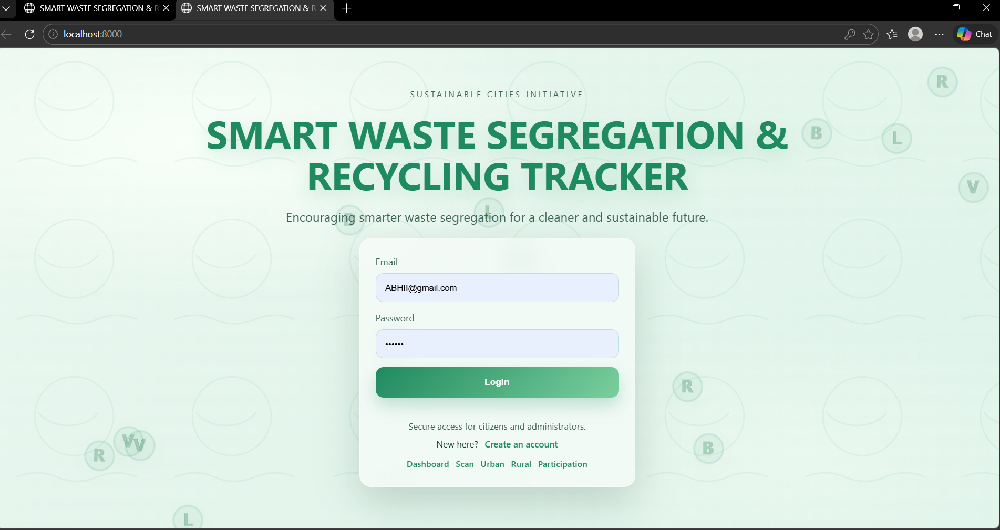
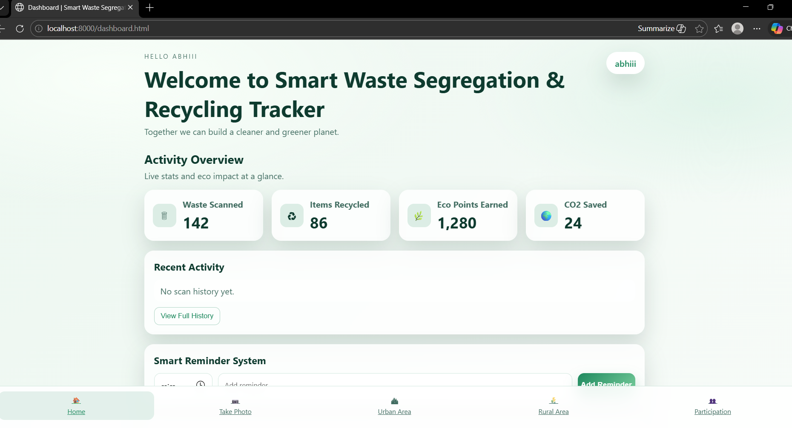

# ECOSORT

## Smart Waste Segregation & Recycling Tracker

A lightweight Python HTTP server that serves a multi-page static web UI for a smart waste segregation and recycling tracker, plus a minimal MySQL-backed API for scan history.

## Features

- Multi-page responsive UI (login, registration, dashboard, scan, urban, rural, participation)
- Static asset serving via a simple Python server
- MySQL-backed scan history + user auth API with connection health check
- Optional unit tests for the data layer

## Application Screenshots

### Login Page

User sign-in screen with a clean, eco-themed interface and quick navigation links.



### Dashboard Overview

Main dashboard showing activity metrics, recent actions, and quick access to key modules.



## Tech Stack

- Python 3 (standard library)
- MySQL
- HTML/CSS/JavaScript

## Installation

1. Ensure Python 3 is installed.
2. Install dependencies:

```bash
pip install -r requirements.txt
```

## Database Setup (MySQL)

The app will try to create the database and `scans` + `users` tables automatically on startup.
If your MySQL user does not have `CREATE` privileges, create the database manually:

```sql
CREATE DATABASE IF NOT EXISTS `ECOSORT DB`;
```

## Configure DB Credentials

Update the MySQL settings in `app.py` (or set environment variables as shown below):

```
DB_CONFIG = {
    "host": "127.0.0.1",
    "port": 3306,
    "database": "ECOSORT DB",
    "user": "root",
    "password": "YOUR_PASSWORD",
}
```

Recommended (more secure): set environment variables instead of hardcoding:

```powershell
$env:ECOSORT_DB_HOST="127.0.0.1"
$env:ECOSORT_DB_PORT="3306"
$env:ECOSORT_DB_NAME="ECOSORT DB"
$env:ECOSORT_DB_USER="root"
$env:ECOSORT_DB_PASSWORD="your_password"
```

To persist them across new terminals on Windows:

```powershell
setx ECOSORT_DB_HOST "127.0.0.1"
setx ECOSORT_DB_PORT "3306"
setx ECOSORT_DB_NAME "ECOSORT DB"
setx ECOSORT_DB_USER "root"
setx ECOSORT_DB_PASSWORD "your_password"
```

## Run

```bash
python app.py
```

Open `http://localhost:8000` in your browser.

## API

Basic JSON endpoints (MySQL-backed):

- `GET /api/health`
- `POST /api/register`
- `POST /api/login`
- `GET /api/scans`
- `GET /api/scans/{id}`
- `POST /api/scans`
- `GET /api/history` (alias for scans)

Health response example:

```json
{"status":"ok","db":"connected"}
```

Example request:

```bash
curl -X POST http://localhost:8000/api/scans \
  -H "Content-Type: application/json" \
  -d "{\"item\":\"Plastic Bottle\",\"waste_type\":\"Recyclable\",\"recommendation\":\"Rinse and recycle\",\"action\":\"Place in recycling bin\"}"
```

## Tests (Optional)

```bash
python -m unittest
```

To include MySQL integration tests, ensure MySQL is running + credentials are set, then run:

```powershell
$env:ECOSORT_RUN_DB_TESTS="1"
python -m unittest
```

## Project Structure

```
root/
  app.py
  backend/
  data/
  tests/
  src/
    index.html
    register.html
    dashboard.html
    participation.html
    rural.html
    scan.html
    urban.html
  assets/
    css/
    js/
    images/
  docs/
    screenshots/
      login-page.png
      dashboard-overview.png
  .gitignore
  README.md
  requirements.txt
  LICENSE
```
